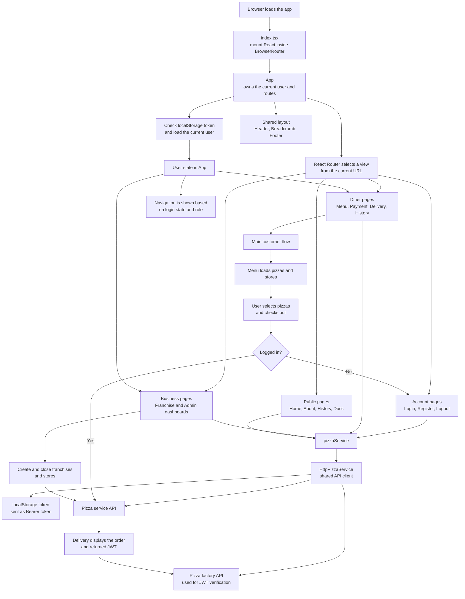

# Frontend architecture

JWT Pizza is a Vite-served React single-page application. React Router owns the URL and the application keeps the authenticated user in `App` state. The diagram below shows the main render, navigation, and data flows.

## Key implementation details

- `index.tsx` mounts `App` inside `BrowserRouter`; `App` defines the route table and renders the shared header, breadcrumb, main content, and footer.
- `App` loads the current user once on startup. Navigation visibility is constrained by login state and roles, while `AdminDashboard` also checks the admin role before rendering its content.
- Views communicate through React Router location state for transient data such as an order, JWT confirmation, or the franchise/store being edited. `useBreadcrumb` returns to the parent path after management actions.
- All API calls go through `pizzaService` (`service.ts`), whose current implementation is `HttpPizzaService`. It adds JSON headers, cookies, and a `Bearer` token from `localStorage`, then delegates to the configured service or factory API.
- The primary customer journey is `Menu → Payment → Delivery`; payment requires a logged-in user, and delivery can send the returned JWT to the factory API for verification.
